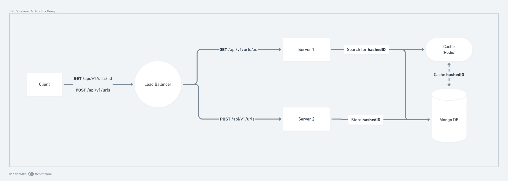
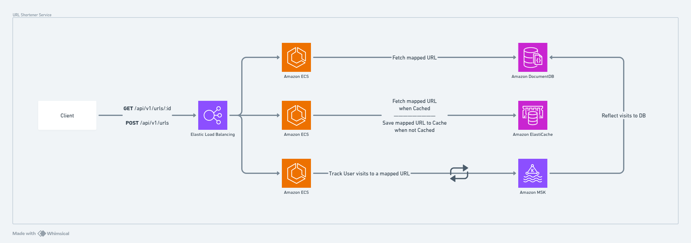
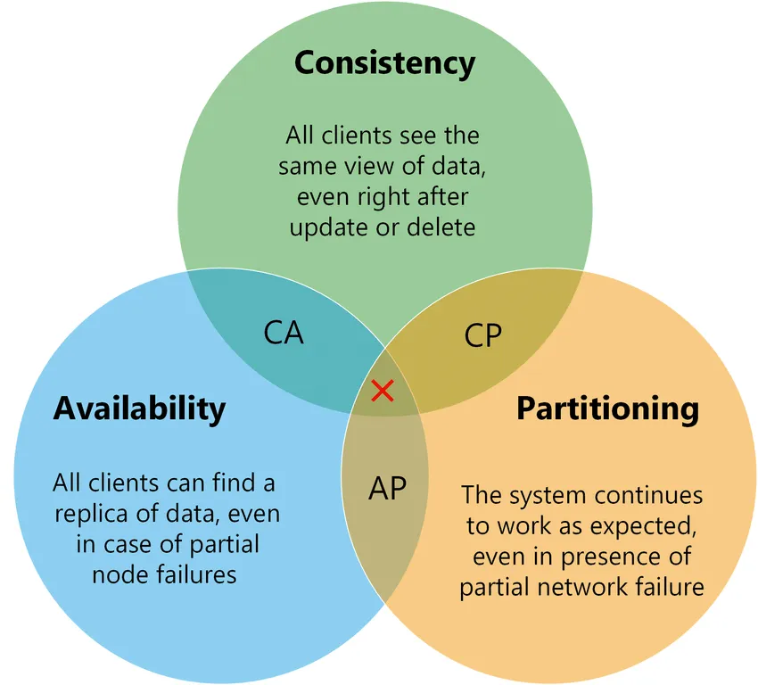

# URL Shortener Service

A Scalable service for providing a shorter URL, simillar to [TINYURL](https://tinyurl.com/)

## Architicture

While this system design needs to be scalable, there are many considerations and challenges arising regarding the Architicture and System Design of the service.

### Dockerized Environment

Docker can offer a pretty scalable archicture either with local setup or cloud, we will be presenting both.

#### Docker Setup



#### Cloud Setup



Both setups implement the same behaviour, basically a **Load Balancer** will be responsibile for re-routing our request to the least busy server, while servers will interact with **Caching** service to reduce the load on our database increasing *Performance* which is the GOAL here!

### CAP Theorem



The CAP Theorem presents the most essential 3 aspects to consider while biulding an Architicture for any system, in our case we had to choose the <u>**AP**</u> and sacrifice *Consistency* where Availability and Paritioning wins for this service!

### Databases and Caching

Since this service's system design requires much relations so we went with a NoSQL database, this project is biult with [MongoDB](https://www.mongodb.com/)

### AI Discussion

Using AI to discuss possible "bottlenecks" and explore ideas is a plus for Engineers, Here's a shared link including mine regarding the Architciture.

[Scalable URL Shortener Architicture with AI](https://chatgpt.com/share/6811f36d-a290-8009-ab15-6cd1e80b3969)

### Run Locally

Service will run in dettached mode with the following command

```bash
 docker compose up -d
```

While all service should run directly out of the box, You can run this command to access instances containers

```bash
 docker compose exec mongo sh/bash
```

Monitor logs through this command

```bash
 docker compose logs mongo -f
```

> change the "mongo" with desired service and choose between bash and sh (depending on the image)

Creating a mapped URL (using CURL)

```bash
 curl -X POST -d targetURL=https://www.google.com/ http://localhost:8101/api/v1/urls
```

> the port **8010** is our Load Balancer's exposed port

##### Future Available Enhancements

- Moving to **[AWS Lambda](https://aws.amazon.com/lambda/)** for better cost management, and higher performance
- Replacement of Docker with **[Kubernetes](https://kubernetes.io/)** or **[Docker Swarm](https://docs.docker.com/engine/swarm/)** as a much scalable environment, with spinning up as much instances as many as needed (will require higher efficient cost management)
